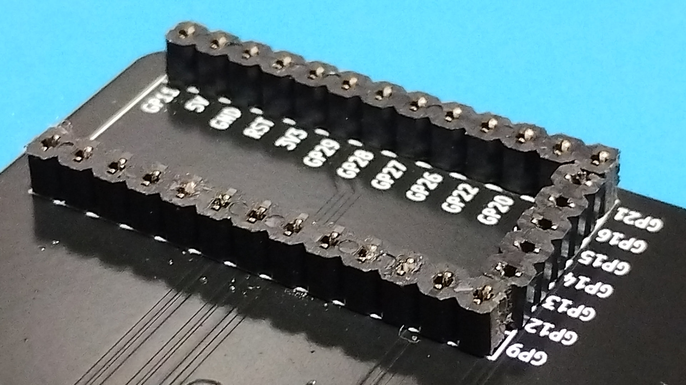
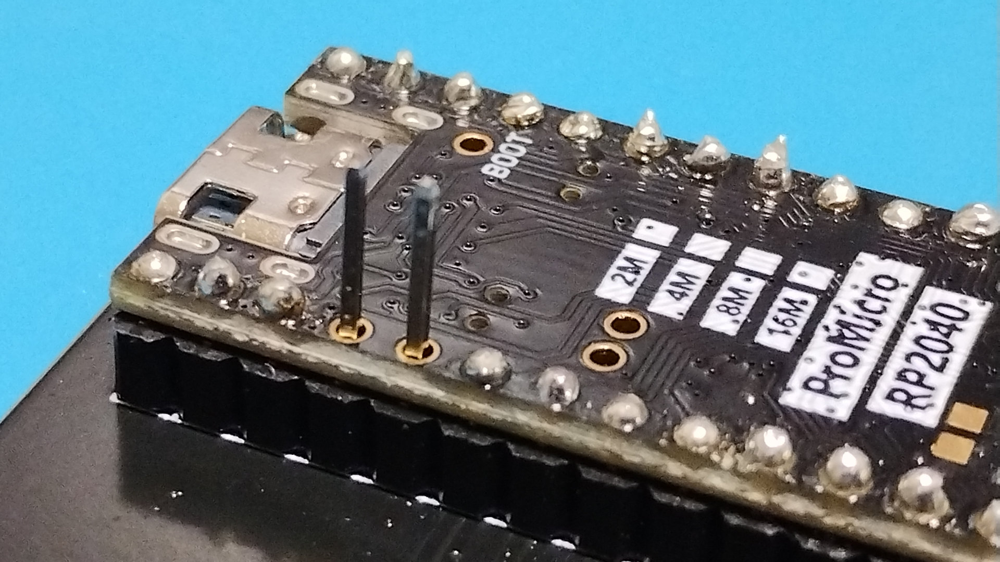

# Microcontroller socketed using low-profile pin sockets

Cut the pinsocket to match the shape of the through-hole and solder it to the PCB.  

Place the microcontroller on the pin socket.  
Next, pull the pins from the pin headers and insert them into the pin sockets.  
Then solder the pins that protrude from the microcontroller.  
Finally, cut the protruding pins and solder them again.  
