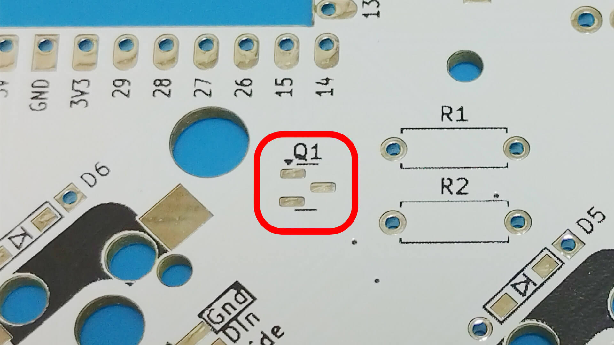
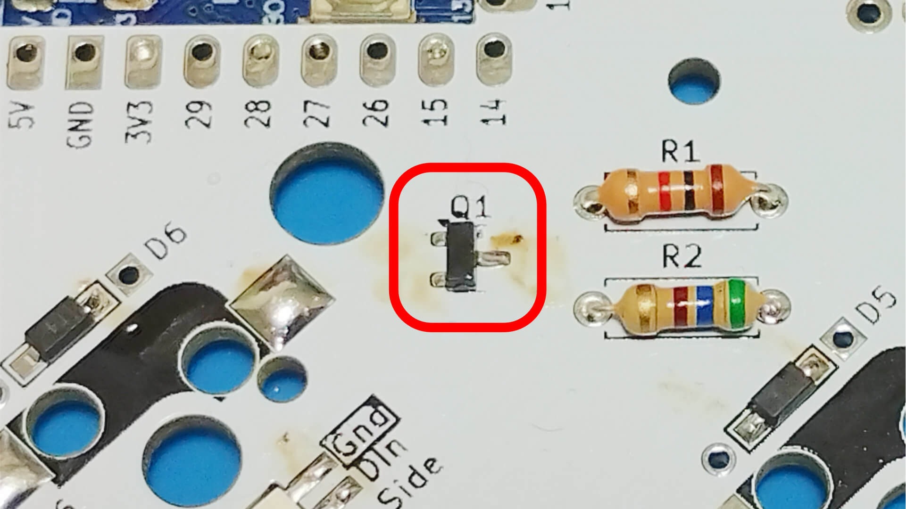

# Soldering MOSFET BSS138 and Resistor

Solder from BSS 138 first.  

Pre-soldering and then adjusting the position with tweezers makes it easier to work.  

Next, also solder the Resistor.  
  

Bend the legs of the resistor before inserting it into the PCB and soldering it from the backside.  
  

Resister legs that stick out are cut and re-soldered.  
