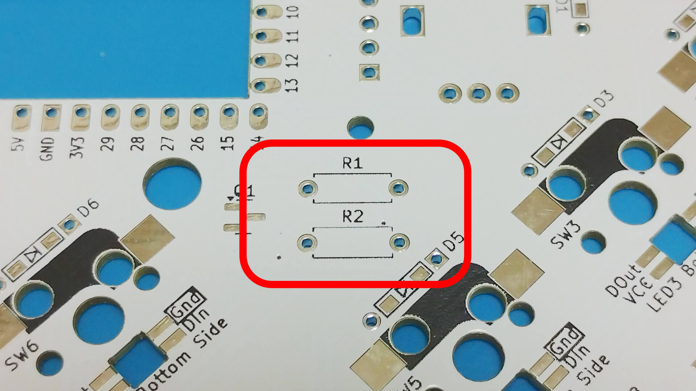
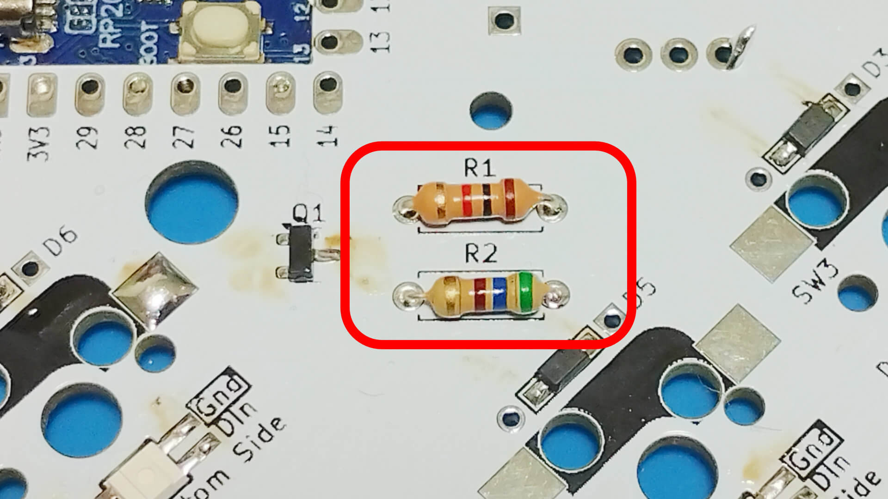
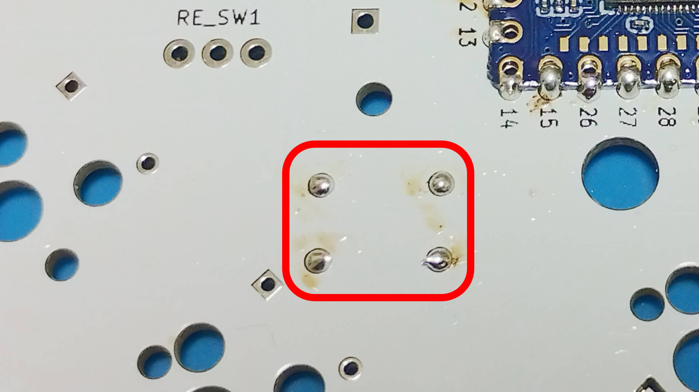

# Soldering Resistor (through-hole type)

Bend the legs of the resistor before inserting it into the PCB and soldering it from the backside.  
  
  

Resister legs that stick out are cut and re-soldered.  
