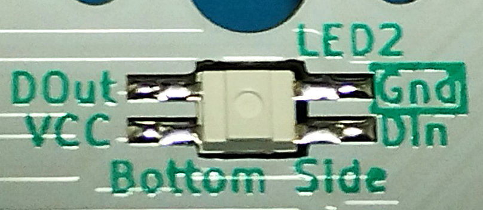

# LED (SK6812 MINI-E) のハンダ付け

あらかじめ予備ハンダを行うことをおすすめします。  
予備ハンダの位置は4つのランドのうち、いずれか1箇所で良いですが、LEDの向きを合わせる必要があるため、GNDが分かりやすいです。  

LEDを基板上に配置し、予備ハンダを行った位置から順番にハンダ付けします。  
LEDは熱に弱いため、ハンダ付けにあまり時間をかけ過ぎないようご注意ください。  
また、フラックスを塗っておくとハンダ付けしやすくなります。  
