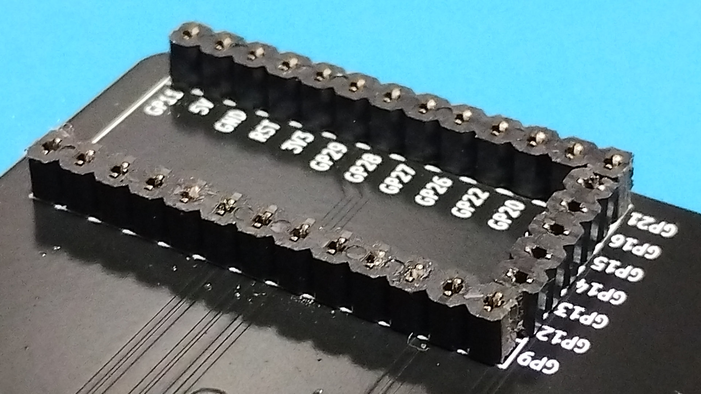
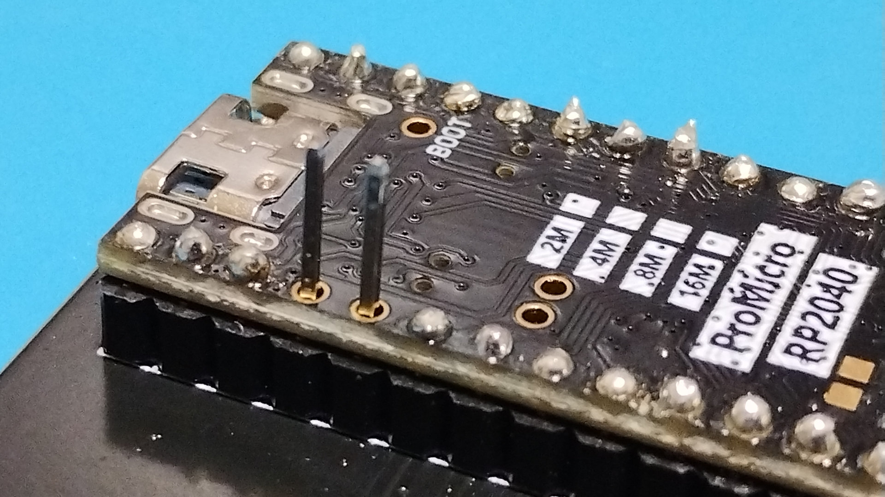

# Microcontroller socketed using low-profile pin sockets

Cut the pinsocket to match the shape of the through-hole and solder it to the PCB.  

First, place the microcontroller on the pin socket.  
Next, use the wire pulled out from the pin header and insert it into the pin socket.  
Finally, solder the wire pulled out from the pin header. Cut the protruding part and solder it again.  
