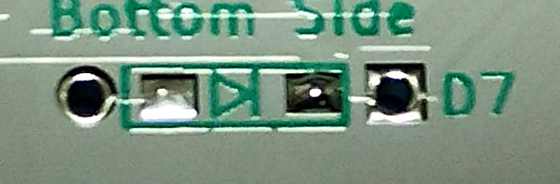

# Soldering diode 1N4148W

Pre-soldering is performed in advance.  
Either of the two lands is fine, but since it is necessary to match the orientation of the diode, it is easier to understand if you solder to the one with the arrow.

Place the diode on the board and solder it. Pay attention to the orientation.  
