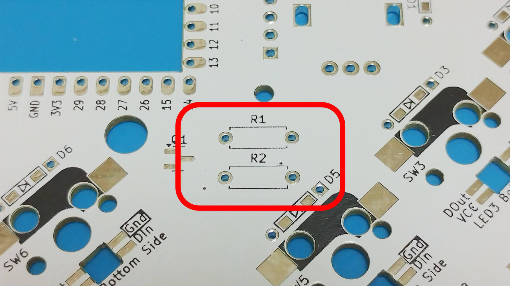
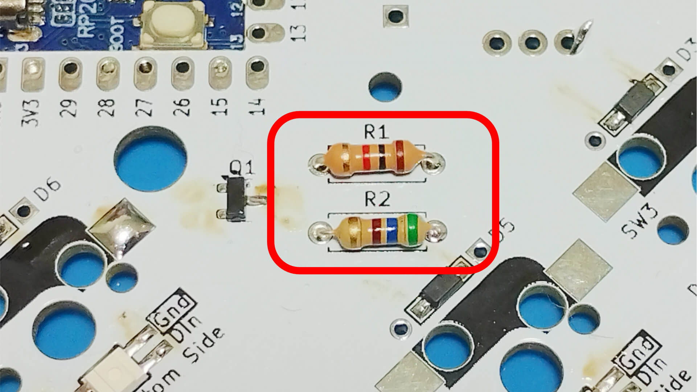
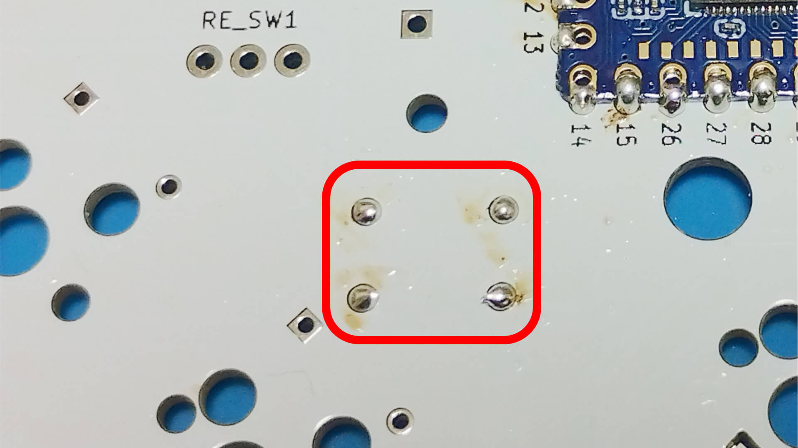

# Soldering MOSFET BSS138 and Resistor

Solder from BSS 138 first.  
Pre-soldering and then adjusting the position with tweezers makes it easier to work.  

Next, also solder the Resistor.  

Resister legs that stick out are cut and re-soldered.  
