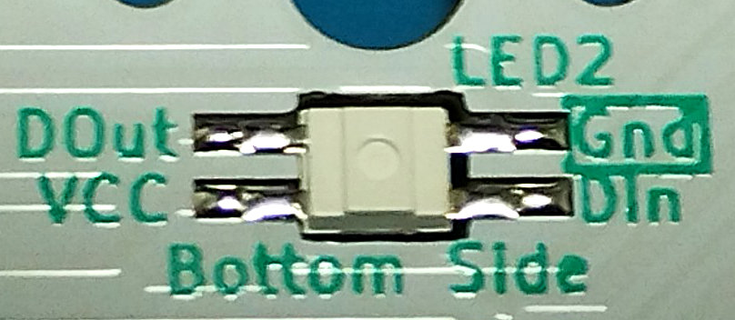

# Soldering led SK6812 MINI-E

Pre-soldering is performed in advance.  
Pre-soldering can be done with any one of the four lands, but since it is necessary to match the orientation of the LEDs, GND is easy to understand.

Place the LEDs on the board and solder them in order, starting from the previously pre-soldered locations.  
Since LEDs are sensitive to heat, do not take too long to solder.
Also, applying flux makes it easier to solder.  
