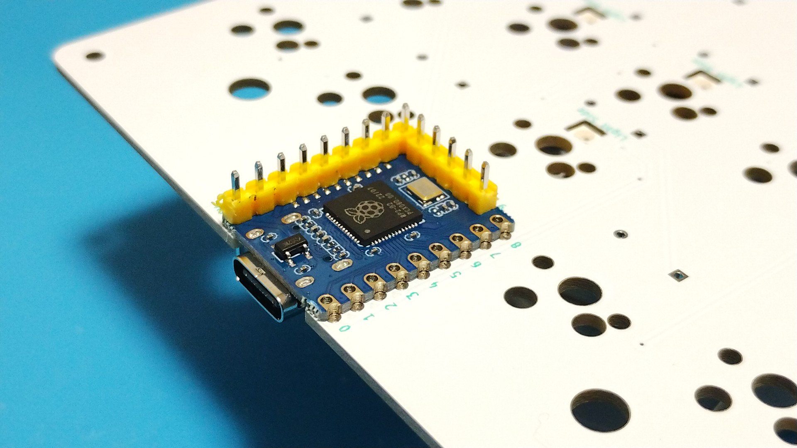
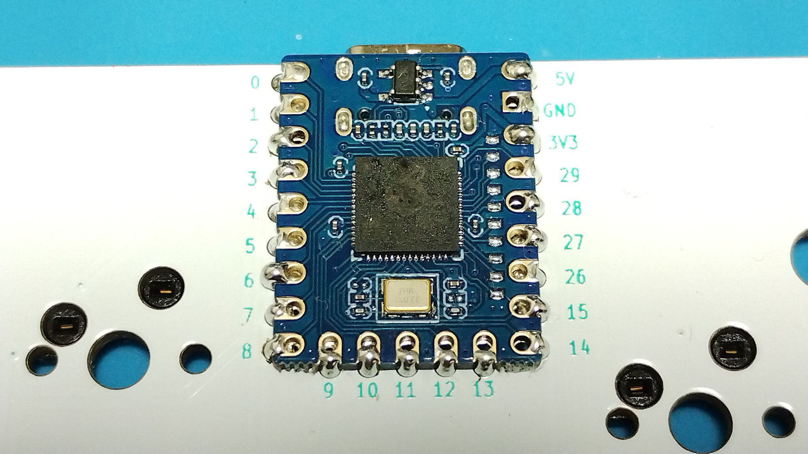

# Surface Mount Soldering RP2040-Zero

Place the RP2040-Zero in line with the PCB recess and temporarily fix it with pin headers.  

Pull out the pin headers at the points to be soldered and solder the microcontroller.  
